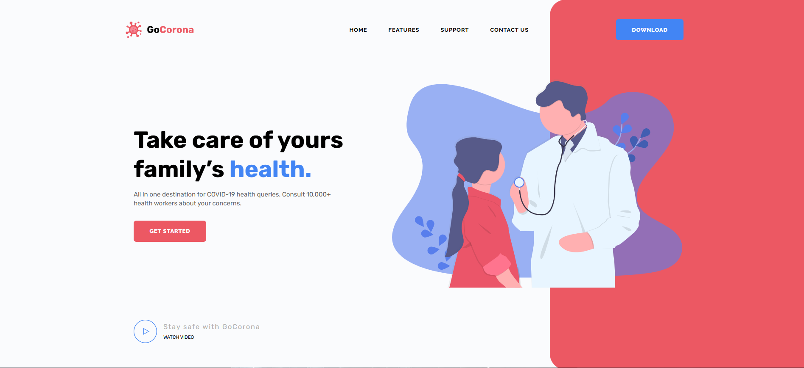
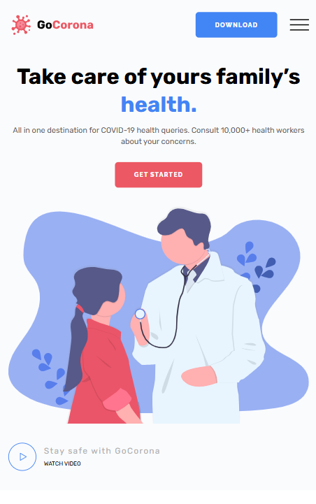
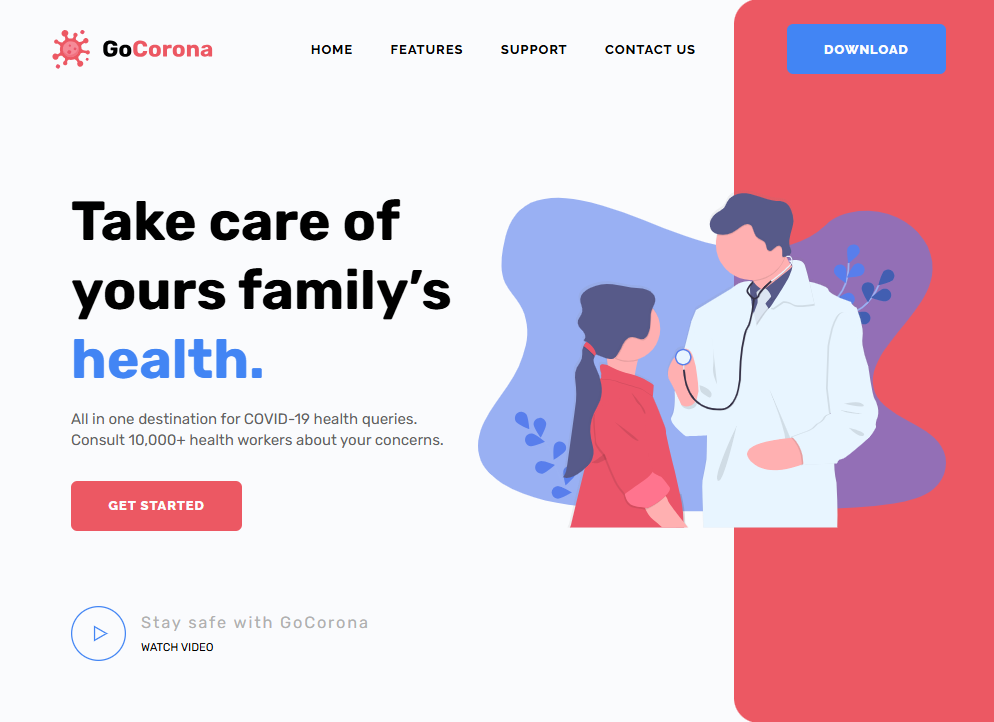

# 🦠 GoCorona

<p align="center">
  
</p>

<p align="center">
  <strong>Modern Responsive Landing Page</strong><br>
  A clean and responsive landing page built with HTML, SCSS and JavaScript.
</p>

<p align="center">


</p>

<p align="center">
<a href="https://bekh-dev.github.io/GoCorona/"><strong>🌐 Live Demo</strong></a>
</p>

---

# 🎬 Preview

<p align="center">

</p>

---

# ✨ Features

- ✅ Fully Responsive Layout
- ✅ Semantic HTML5
- ✅ SCSS Architecture
- ✅ JavaScript Interactivity
- ✅ BEM Methodology
- ✅ Pixel Perfect Layout
- ✅ Smooth Animations
- ✅ Cross-browser Compatibility
- ✅ Clean Folder Structure

---

# 🛠 Tech Stack

| Technology | Description |
|------------|-------------|
| HTML5 | Page structure |
| SCSS | Styling |
| JavaScript | Interactive functionality |
| Git | Version control |
| GitHub Pages | Deployment |

---

# 📸 Screenshots

## 💻 Desktop

<p align="center">

</p>

---

## 📱 Mobile

<p align="center">

</p>

---

## 📟 Tablet

<p align="center">

</p>

---

# 📂 Project Structure

```text
GoCorona
│
├── assets/
│   ├── demo.gif
│   ├── preview-desktop.png
│   ├── preview-mobile.png
│   └── preview-tablet.png
│
├── css/
├── js/
├── img/
│
├── index.html
└── README.md
```

---

# 🚀 Getting Started

Clone the repository

```bash
git clone https://github.com/Bekh-dev/GoCorona.git
```

Go to the project folder

```bash
cd GoCorona
```

Open

```text
index.html
```

or use Live Server.

---

# 📚 What I Practiced

During this project I improved my skills in:

- Semantic HTML
- SCSS
- Responsive Web Design
- JavaScript DOM
- Git & GitHub
- Clean Code Organization

---

# 🔮 Future Improvements

- Improve accessibility
- Add dark mode
- Optimize images
- Improve animations
- Add more interactive components

---

# 👨‍💻 Author

**Bekhzod**

GitHub:
https://github.com/Bekh-dev

If you like this project, don't forget to ⭐ the repository.
